# Setup the Environment

## Introduction
This lab walks you through the steps to configure your cloud environment, define security and access controls, and create an Oracle Container Engine for Kubernetes (OKE) cluster.

Estimated Lab Time: 10 minutes

### Objectives

In this lab, you will:
* Create a Compartment in your Tenancy
* Create and configure an IAM Dynamic Group
* Deploy an OKE cluster

### Prerequisites

* An Oracle Free Tier, Always Free, Paid or LiveLabs Cloud Account.  Please refer to the Prerequisites section for instructions on how to obtain a Free Tier account.
* A compatible browser


## **STEP 1**: Create an IAM Compartment

A compartment is a virtual container within your Cloud account used to organize and group related resources for easier management.  When creating a compartment, you must provide a unique name and also a description. 

1. In the OCI Management Console, locate and expand the main menu control. This is typically in the upper left corner of your browser, but console layouts may vary between versions. 

    

      Expand the list of services and navigate down to **Identity** ---> **Compartments**.
      
      
  
2. Select the **Create Compartment** button.

    

3. Enter **devlivedemo** in the **Name** field and give your Compartment a brief description.  Click the **Create Compartment** button to complete the creation.

    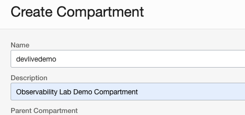

4. Most likely, you'll be returned to the **IAM** --> **Compartments** page. Click on your new Compartment name **devlivedemo** to open the Compartment Details page.  Locate and record the unique identifier (**OCID**) for this Compartment.  This identifier is required in Step 2.

    


## **STEP 2:** Create and Configure an IAM Dynamic Group

Dynamic groups allow you to assign permissions to Virtual Machines and allow these systems to autonomously perform specific actions against Oracle Cloud Infrastructure services. In this manner you allow applications and systems running on your Virtual Machines to use the Logging Service, for example to dynamically push logs to the centralized service in near-real time.  When you create a dynamic group, rather than adding members explicitly to the group, you instead define a set of matching rules to define the group members. For example, a rule could specify that all instances in a particular compartment are members of the dynamic group. The members can change dynamically as instances are launched and terminated in that compartment.

1. In the OCI Management Console open the Main Menu, navigate to **Identity** --> **Dynamic Groups**. 

      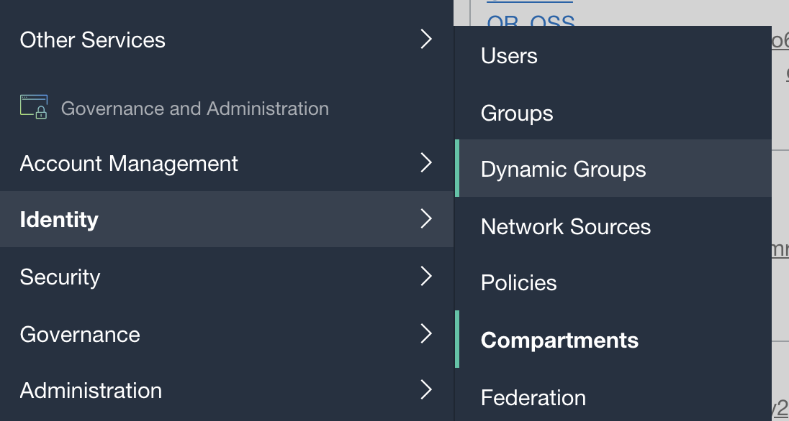

2. Select the **Create Dynamic Group** button.

      

3. Enter **devlivedg** in the **Name** field and give your Dynamic Group a brief description.

      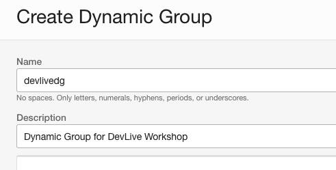

4. Next we will create **Matching Rules** to select which Virtual Machines should be included in this Dynamic Group.  In a production environment, you may be very selective about the specific Virtual Machines that may be included in this group to strictly limit the permissions they inherit.  In this workshop, we will create a rule to include all Virtual Machines within the devlivedemo Compartment created in Step 1.  **Add the following statement** in the **Matching Rules** --> **RULE 1** box. Note: change the OCID to match your OCID recorded in Step 1, keeping the single quotes surrounding this value.  If you no longer have this OCID readily available, it may be obtained by navigating to the **Identity** --> **Compartments** --> **devlivedemo** property page.  

    ```
    instance.compartment.id = 'ocid1.compartment.oc1..aaaaaaaaakqxljn2xvohyoe5hdpcabnpfitoh3ef3sjcnjfzjhfi2nbgv3yq'
    ```
      

5. Click **Create** to complete the process and close the dialog screen.

6. Next we will create **Policies** for your Dynamic Group to grant Virtual Machines the ability to push logs to the Logging Service and Metrics to the Monitoring Service.  

7. Navigate to the **Identity** --> **Policies** page and ensure **Compartment** devlivedemo is selected in the left column.

      
   
8. Click **Create**, name your new policy "devlivepolicy" and give it a brief description.  For **Compartment** select your root compartment.
 
      

9. In the **Policy Builder** section select the "**Show manual editor**" option. Enter the following code in the policy box, as shown in the figure below:
   
    ```
   Allow dynamic-group devlivedg to use log-content in compartment devlivedemo
   Allow dynamic-group devlivedg to use metrics in compartment devlivedemo
   Allow dynamic-group devlivedg to manage functions-family in compartment devlivedemo
    ```
      
   
10. Click **Create** to complete the process and close the dialog screen.

## **STEP 3:** Deploy an OKE (Oracle Container Engine for Kubernetes) Cluster

Container Engine for Kubernetes (OKE) is an Oracle-managed container orchestration service that can reduce the time and cost to build modern cloud native applications. Unlike most other vendors, Oracle Cloud Infrastructure provides Container Engine for Kubernetes as a free service that runs on higher-performance, lower-cost compute shapes. DevOps engineers can use unmodified, open source Kubernetes for application workload portability and to simplify operations with automatic updates and patching.

1. In the OCI Management Console, choose a region to deploy your OKE cluster. 

      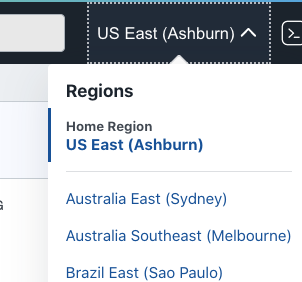

2. Open the Main Menu, Navigate to **Developer Services** --> **Kubernetes Clusters (OKE)**

      

3. Ensure **Compartment** devlivedemo is selected in the drop down box on the left navigation bar.

      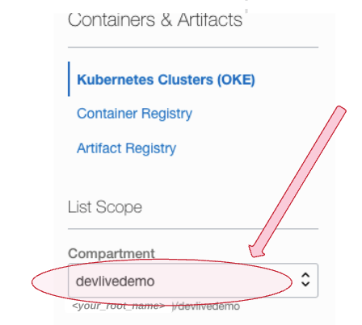

4. Select the **Create Cluster** button

      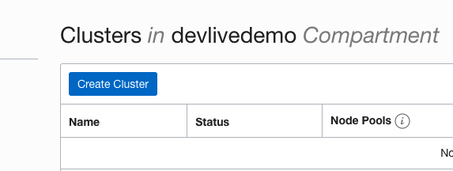

5.   In the **Create Cluster** dialog screen enter select **Quick Create** and then **Launch Workflow**.

      

6.  On the **Quick Create Cluster** details page keep the default settings, or optionally choose a custom cluster name, worker node shape, etc.  Select **Next** to review.

      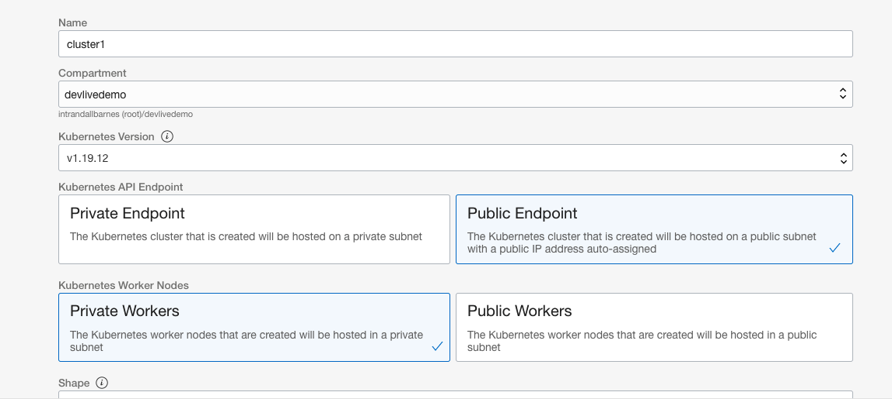

7.  In the **Quick Create Cluster** review page, select **Create Cluster** to launch the deployment.

      

8.  The cluster deployment process may take 2 or 3 minutes to complete.  In the meantime, let's move on to the final step of your cloud environment setup.

 
## **STEP 4:** Launch Cloud Shell

The final step of this section is to launch Cloud Shell, download sample code files to your Cloud Shell session, and verify your OKE cluster is online and ready.

1.  In the OCI Management Console, ensure you have selected the same region as your OKE cluster created in Step 3.  Select the **Cloud Shell** icon in the upper right corner of the toolbar (see image below).  

      

This will launch a small virtual machine configured with your specific OCI user permissions. A direct shell connection will open in the console window.  You can minimize and maximize this shell as desired.
      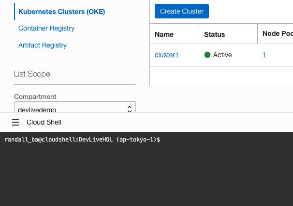

Within the Cloud Shell session , download the **sample code** files by executing the following wget command:

```
   wget https://objectstorage.us-phoenix-1.oraclecloud.com/p/-GEEGkMqE-MW-EmQxeFUrAuNdzAnfIxB_G4Vqd8kNMSi-OFLnMRQsvUrWCjVu_q8/n/intrandallbarnes/b/devlive-hol-082022/o/devlive-hol.zip

```

Unzip the package by executing the following command:

```
    unzip devlive-hol.zip
```

2. By this time your OKE cluster should be online and available.  Navigate to **Developer Services** --> **Kubernetes Clusters (OKE)** if you are not already on this console page.  Click on your cluster name **cluster1** to open the cluster properties page.  Locate and open the **Quick Start** shortcut link on the lower left navigation bar to open the **Quick Start: Deploy Sample App** instructions. 

      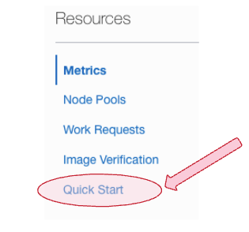

Select **Access Cluster**
      

Ensure **Cloud Shell Access** is selected.  You should be able to skip Step 1, unless your Cloud Shell session has closed.  Perform Step 2 by executing the listed command in your Cloud Shell session. 

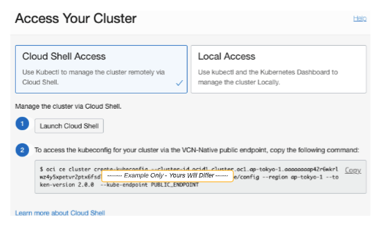

Click **Close** to exit the Access Your Cluster dialog.

Continue implementing steps 2 and 3 listed in the **Quick Start: Deploy Sample App** dialog.  This will verify connectivity to your cluster and the deploy apps from your Cloud Shell session.

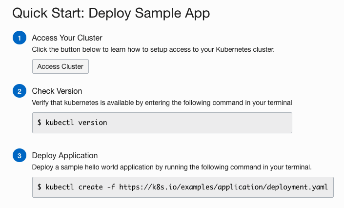

After completing step 3, verify the deployment is active by executing the following command:
```
$ kubectl get deployments
```

Your output should be similar to the following:

```
NAME               READY   UP-TO-DATE   AVAILABLE   AGE
nginx-deployment    2/2     2            2          16s
```

Finally, delete the sample deployment by executing the following command:

```
$ kubectl delete deployment nginx-deployment
```

You should see confirmation similar to the following:

```
deployment.apps "nginx-deployment" deleted
```

 **Congratulations!**  You have completed the **Setup the Environment** Lab. You may proceed to the next lab: **OKE Apps and OCI Logging**

## Learn More

* [Working with Compartments](https://docs.cloud.oracle.com/en-us/iaas/Content/Identity/Tasks/managingcompartments.htm#Working)
* [Managing Dynamic Groups](https://docs.cloud.oracle.com/en-us/iaas/Content/Identity/Tasks/managingdynamicgroups.htm)
* [Oracle Container Engine for Kubernetes](https://www.oracle.com/cloud-native/container-engine-kubernetes/)
* [OCI Cloud Shell](https://docs.oracle.com/en-us/iaas/Content/API/Concepts/cloudshellintro.htm)

## Acknowledgements
* **Author** - Randall Barnes, Solution Architect, OCI Observability Team
* **Last Updated Date** - July, 2021

## Need Help?
Please submit feedback or ask for help using our [LiveLabs Support Forum](https://community.oracle.com/tech/developers/categories/livelabsdiscussions). Please click the **Log In** button and login using your Oracle Account. Click the **Ask A Question** button to the left to start a *New Discussion* or *Ask a Question*.  Please include your workshop name and lab name.  You can also include screenshots and attach files.  Engage directly with the author of the workshop.

If you do not have an Oracle Account, click [here](https://profile.oracle.com/myprofile/account/create-account.jspx) to create one.
